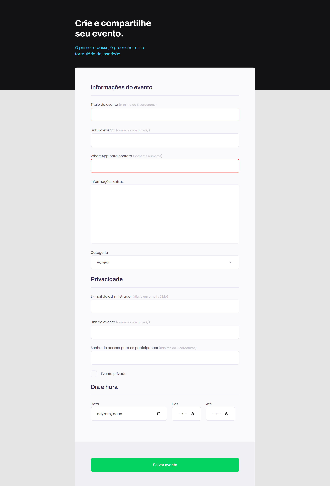

# Explorer Turma 6

> Projeto 03 criado no programa Explorer da RocketSeat

Nesse projeto aprendemos sobre formulários, como criar e estilizá-los, usando de ferramentas para manter a acessibilidade do projeto sem perder a beleza

## Tecnologias
HTML
CSS

## Contato
daniel.aretakis@hotmail.com